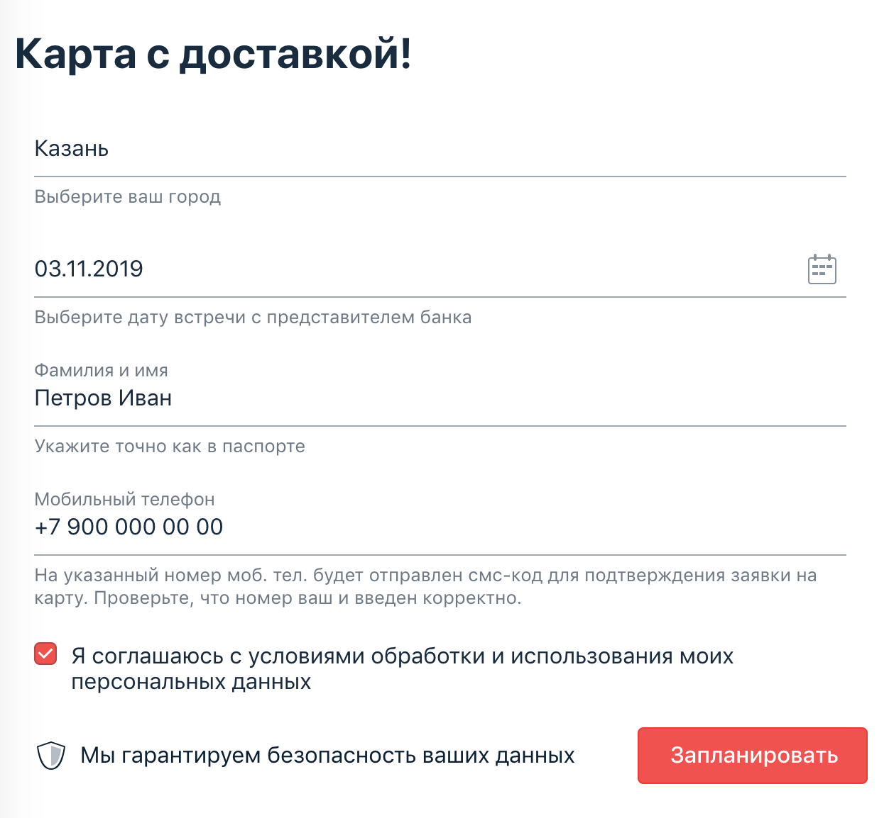

[](https://ci.appveyor.com/project/Nephedov/cardorderdeliverychangedate)

# «Patterns»

## Решения
### Задание 1
 * <a href="https://github.com/Nephedov/6.1.Automated-Testing/blob/main/src/test/java/ru/netology/DataGenerator.java">DataGenerator.java</a>. - класс для генерации тестовых данных.
 * <a href="https://github.com/Nephedov/6.1.Automated-Testing/blob/main/src/test/java/ru/netology/CardOrderDeliveryChangeDateTest.java">CardOrderDeliveryChangeDateTest.java</a>. - класс с автотестами.

<a href="https://github.com/Nephedov/6.1.Automated-Testing">Репозиторий</a> с проектом.
### Задание 2
 * <a href="https://github.com/Nephedov/6.2.Automated-Testing/blob/main/src/test/java/ru/netology/RegHelper.java">RegHelper.java</a>. - класс для создания тестового пользователя.
 * <a href="https://github.com/Nephedov/6.2.Automated-Testing/blob/main/src/test/java/ru/netology/AuthTest.java">AuthTest.java</a>. - класс с автотестами.

<a href="https://github.com/Nephedov/6.2.Automated-Testing">Репозиторий</a> с проектом.
## Что было сделано
### Задание 1
* Настроен <a href="https://github.com/Nephedov/6.1.Automated-Testing/blob/main/build.gradle">build.gradle</a> с зависимостями:
	* JunitJupier.
	* Selenide.
	* Faker.
	* Lombok.
* Подключен к проекту AppVeyor. Настроен <a href="https://github.com/Nephedov/6.1.Automated-Testing/blob/main/.appveyor.yml">appveyor.yml</a>. Добавлен бейдж в README.md, о статусе сборки при пуше.
* Создан <a href="https://github.com/Nephedov/6.1.Automated-Testing/blob/main/.gitignore">.gitignore</a>.
* Автоматизированы тестовые сценарии новой функции формы заказа доставки карты - <a href="https://github.com/Nephedov/6.1.Automated-Testing/blob/main/src/test/java/ru/netology/CardOrderDeliveryChangeDateTest.java">CardOrderDeliveryChangeDateTest.java</a>.
* Создан служебный класс получения тестовых данных - <a href="https://github.com/Nephedov/6.1.Automated-Testing/blob/main/src/test/java/ru/netology/DataGenerator.java">DataGenerator.java</a>.
### Задание2
* Настроен <a href="https://github.com/Nephedov/6.2.Automated-Testing/blob/main/build.gradle">build.gradle</a> с зависимостями:
	* JunitJupier.
	* Selenide.
	* Faker.
	* Rest-Assured.
	* GoogleCodeJSON.
	* Lombok.
* Подключен к проекту AppVeyor. Настроен <a href="https://github.com/Nephedov/6.2.Automated-Testing/blob/main/.appveyor.yml">appveyor.yml</a>. Добавлен бейдж в README.md, о статусе сборки при пуше.
* Создан <a href="https://github.com/Nephedov/6.2.Automated-Testing/blob/main/.gitignore">.gitignore</a>.
* Реализован служебный класс, описывающий API запросы создания пользователя - <a href="https://github.com/Nephedov/6.2.Automated-Testing/blob/main/src/test/java/ru/netology/RegHelper.java">RegHelper.java</a>.
* Реализованы автотесты на авторизацию, с предусловием создания тестового пользователя через API запрос - <a href="https://github.com/Nephedov/6.2.Automated-Testing/blob/main/src/test/java/ru/netology/AuthTest.java">AuthTest.java</a>.

---
---


## Описание Задания №1: заказ доставки карты (изменение даты)

Вам необходимо автоматизировать тестирование новой функции формы заказа доставки карты:



Тестируемая функциональность: если заполнить форму повторно теми же данными, за исключением «Даты встречи», то система предложит перепланировать время встречи.

После нажатия кнопки «Перепланировать» произойдёт перепланирование встречи.

## Описание Задания №2: тестовый режим

Разработчики интернет-банка, изрядно поворчав, предоставили вам тестовый режим запуска целевого сервиса, в котором открыта программная возможность создания клиентов банка, чтобы вы могли протестировать хотя бы функцию входа.

Для удобства вам предоставили документацию, которая описывает возможность программного создания клиентов банка через API. Вот дословно представленное ими описание:
```
Для создания клиента нужно делать запрос вида:

POST /api/system/users
Content-Type: application/json

{
    "login": "vasya",
    "password": "password",
    "status": "active" 
}

Возможные значения поля «Статус»:
* «active» — пользователь активен,
* «blocked» — пользователь заблокирован.

В случае успешного создания пользователя возвращается код 200.

При повторной передаче пользователя с таким же логином будет выполнена перезапись данных пользователя.
```


Для активации этого тестового режима при запуске SUT нужно указать флаг `-P:profile=test`, то есть:
`java -jar app-ibank.jar -P:profile=test`.

**Важно:** если вы не активируете тестовый режим, любые запросы на http://localhost:9999/api/system/users будут вам возвращать 404 Not Found. 
