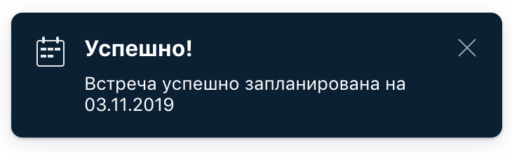

[](https://ci.appveyor.com/project/Nephedov/cardorderdeliverychangedate)

# Домашнее задание к занятию «2.3. Patterns»

## Решения
### Задание 1
 * <a href="https://github.com/Nephedov/6.1.Automated-Testing/blob/76ef7abd12897553c69a9763b5d1be0cc3a1ece6/src/test/java/ru/netology/DataGenerator.java">DataGenerator.java</a>. - класс для генерации тестовых данных.
 * <a href="https://github.com/Nephedov/6.1.Automated-Testing/blob/76ef7abd12897553c69a9763b5d1be0cc3a1ece6/src/test/java/ru/netology/CardOrderDeliveryChangeDateTest.java">CardOrderDeliveryChangeDateTest.java</a>. - класс с автотестами.
### Задание 2
 * <a href="https://github.com/Nephedov/6.2.Automated-Testing/blob/9625843a3c33c58e18bcc64b7c9c6719197ba7e4/src/test/java/ru/netology/RegHelper.java">RegHelper.java</a>. - класс на создания тестового пользователя.
 * <a href="https://github.com/Nephedov/6.2.Automated-Testing/blob/9625843a3c33c58e18bcc64b7c9c6719197ba7e4/src/test/java/ru/netology/AuthTest.java">AuthTest.java</a>. - класс с автотестами.
## Что было сделано
  * Создан и настроен Gradle проект с зависимостями:
    * JunitJupier.
    * Selenide.
    * Faker.
    * Подключен к проекту AppVeyor. Настроен appveyor.yml. Добавлен бейдж в README.md, о статусе сборки при пуше.
    * Автоматизировано тестирование новой функции формы заказа доставки карты.
    * Создан служебный класс получения тестовых данных.
  * Создан и настроен Gradle проект с зависимостями:
    * JunitJupier.
    * Selenide.
    * Faker.
    * Rest-Assured.
    * GoogleCodeJSON.
    * Lombok.
    * Подключен к проекту AppVeyor. Настроен appveyor.yml. Добавлен бейдж в README.md, о статусе сборки при пуше.
    * Реализованы автотесты на авторизацию, с предусловием создания тестового пользователя через API запрос.
    * Создан служебный класс с API запросом на создание нового пользователя.

## Задача №1: заказ доставки карты (изменение даты)

Вам необходимо автоматизировать тестирование новой функции формы заказа доставки карты:


Требования к содержимому полей, сообщения и другие элементы, по словам заказчика и разработчиков, такие же, они ничего не меняли.

Примечание: личный совет — не забудьте это перепроверить, никому нельзя доверять 😈

Тестируемая функциональность: если заполнить форму повторно теми же данными, за исключением «Даты встречи», то система предложит перепланировать время встречи:


После нажатия кнопки «Перепланировать» произойдёт перепланирование встречи:



**Важно:** в этот раз вы не должны хардкодить данные прямо в тест. Используйте Faker, Lombok, data-классы для группировки нужных полей и утилитный класс-генератор данных — см. пример в презентации. 

## Задача №2: тестовый режим

Разработчики интернет-банка, изрядно поворчав, предоставили вам тестовый режим запуска целевого сервиса, в котором открыта программная возможность создания клиентов банка, чтобы вы могли протестировать хотя бы функцию входа.

Для удобства вам предоставили документацию, которая описывает возможность программного создания клиентов банка через API. Вот дословно представленное ими описание:
```
Для создания клиента нужно делать запрос вида:

POST /api/system/users
Content-Type: application/json

{
    "login": "vasya",
    "password": "password",
    "status": "active" 
}

Возможные значения поля «Статус»:
* «active» — пользователь активен,
* «blocked» — пользователь заблокирован.

В случае успешного создания пользователя возвращается код 200.

При повторной передаче пользователя с таким же логином будет выполнена перезапись данных пользователя.
```

Давайте вместе разбираться. Мы уже проходили:
* клиент-серверное взаимодействие,
* HTTP-методы и коды ответов,
* формат данных JSON,
* REST-assured.

Мы настоятельно рекомендуем ознакомиться с документацией и примерами на [Rest-assured](http://rest-assured.io).

Подключается обычным образом в Gradle:
```groovy
testImplementation 'io.rest-assured:rest-assured:4.3.0'
testImplementation 'com.google.code.gson:gson:2.8.6'
```

Библиотека [Gson](https://github.com/google/gson) нужна для того, чтобы иметь возможность сериализовать Java-объекты в JSON.

То есть мы не руками пишем JSON, а создаём data-классы, объекты которых и преобразуются в JSON.

Дальнейшее использование выглядит следующим образом:
```java
// спецификация нужна для того, чтобы переиспользовать настройки в разных запросах
class AuthTest {
    private static RequestSpecification requestSpec = new RequestSpecBuilder()
        .setBaseUri("http://localhost")
        .setPort(9999)
        .setAccept(ContentType.JSON)
        .setContentType(ContentType.JSON)
        .log(LogDetail.ALL)
        .build();

    @BeforeAll
    static void setUpAll() {
        // сам запрос
        given() // "дано"
            .spec(requestSpec) // указываем, какую спецификацию используем 
            .body(new RegistrationDto("vasya", "password", "active")) // передаём в теле объект, который будет преобразован в JSON
        .when() // "когда" 
            .post("/api/system/users") // на какой путь относительно BaseUri отправляем запрос
        .then() // "тогда ожидаем"
            .statusCode(200); // код 200 OK
    }
    ...
}
```

Это не лучший формат организации, будет лучше, если, как в предыдущей задаче, вы вынесете это в класс-генератор, который по требованию вам будет создавать рандомного пользователя, сохранять его через API и возвращать вам в тест.

В логах теста вы увидите:
```
Request method:	POST
Request URI:	http://localhost:9999/api/system/users
Proxy:			<none>
Request params:	<none>
Query params:	<none>
Form params:	<none>
Path params:	<none>
Headers:		Accept=application/json, application/javascript, text/javascript, text/json
				Content-Type=application/json; charset=UTF-8
Cookies:		<none>
Multiparts:		<none>
Body:
{
    "login": "vasya",
    "password": "password",
    "status": "active" 
}
```

Для активации этого тестового режима при запуске SUT нужно указать флаг `-P:profile=test`, то есть:
`java -jar app-ibank.jar -P:profile=test`.

**Важно:** если вы не активируете тестовый режим, любые запросы на http://localhost:9999/api/system/users будут вам возвращать 404 Not Found. 

Вам нужно самостоятельно изучить реакцию приложения на различные комбинации случаев, для этого придётся вспомнить комбинаторику:
* наличие пользователя;
* статус пользователя;
* невалидный логин;
* невалидный пароль.

Дополнительно: оцените время, которое вы затратили на автоматизацию, и время, за которое вы проверили бы те же сценарии вручную, используя для тестирования интерфейса браузер и Postman для доступа к открытому API.

Приложите к решению задачи в формате:
* время, затраченное на ручное тестирование (минут): x;
* время, затраченное на автоматизацию (минут): y.
